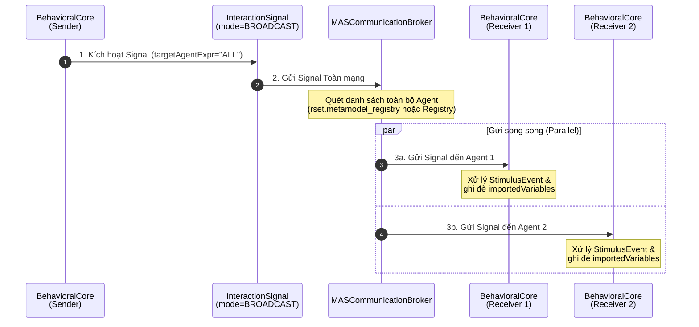

```mermaid
sequenceDiagram
autonumber
participant BC_S as BehavioralCore<br/>(Sender)
participant IS as InteractionSignal<br/>(mode=BROADCAST)
participant Broker as MASCommunicationBroker
participant BC_R1 as BehavioralCore<br/>(Receiver 1)
participant BC_R2 as BehavioralCore<br/>(Receiver 2)

    BC_S->>IS: 1. Kích hoạt Signal (targetAgentExpr="ALL")
    IS->>Broker: 2. Gửi Signal Toàn mạng

    Note over Broker: Quét danh sách toàn bộ Agent<br/>(rset.metamodel_registry hoặc Registry)

    par Gửi song song (Parallel)
        Broker->>BC_R1: 3a. Gửi Signal đến Agent 1
        Note over BC_R1: Xử lý StimulusEvent &<br/>ghi đè importedVariables
    and
        Broker->>BC_R2: 3b. Gửi Signal đến Agent 2
        Note over BC_R2: Xử lý StimulusEvent &<br/>ghi đè importedVariables
    end


```
