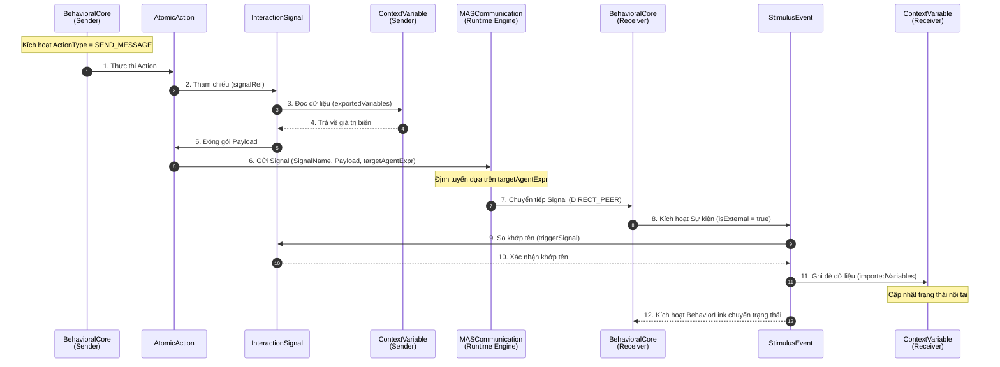

```mermaid
sequenceDiagram
autonumber
participant BC_S as BehavioralCore<br/>(Sender)
participant AA as AtomicAction
participant IS as InteractionSignal
participant CV_S as ContextVariable<br/>(Sender)

    participant Broker as MASCommunication<br/>(Runtime Engine)

    participant BC_R as BehavioralCore<br/>(Receiver)
    participant SE as StimulusEvent
    participant CV_R as ContextVariable<br/>(Receiver)

    Note over BC_S: Kích hoạt ActionType = SEND_MESSAGE
    BC_S->>AA: 1. Thực thi Action
    AA->>IS: 2. Tham chiếu (signalRef)
    IS->>CV_S: 3. Đọc dữ liệu (exportedVariables)
    CV_S-->>IS: 4. Trả về giá trị biến
    IS->>AA: 5. Đóng gói Payload
    AA->>Broker: 6. Gửi Signal (SignalName, Payload, targetAgentExpr)

    Note over Broker: Định tuyến dựa trên targetAgentExpr
    Broker->>BC_R: 7. Chuyển tiếp Signal (DIRECT_PEER)

    BC_R->>SE: 8. Kích hoạt Sự kiện (isExternal = true)
    SE->>IS: 9. So khớp tên (triggerSignal)
    IS-->>SE: 10. Xác nhận khớp tên
    SE->>CV_R: 11. Ghi đè dữ liệu (importedVariables)
    Note over CV_R: Cập nhật trạng thái nội tại
    SE-->>BC_R: 12. Kích hoạt BehaviorLink chuyển trạng thái


```
