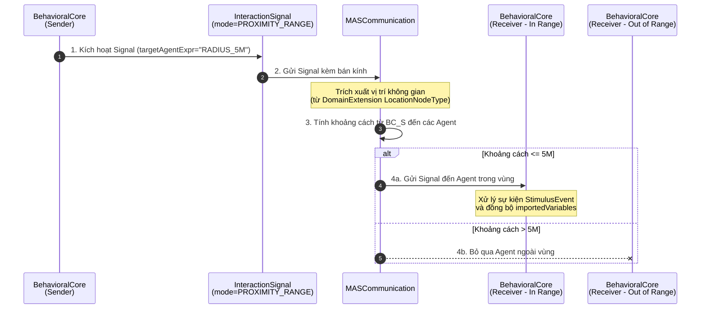

```mermaid
sequenceDiagram
autonumber
participant BC_S as BehavioralCore<br/>(Sender)
participant IS as InteractionSignal<br/>(mode=PROXIMITY_RANGE)
participant Broker as MASCommunication
participant BC_R1 as BehavioralCore<br/>(Receiver - In Range)
participant BC_R2 as BehavioralCore<br/>(Receiver - Out of Range)

    BC_S->>IS: 1. Kích hoạt Signal (targetAgentExpr="RADIUS_5M")
    IS->>Broker: 2. Gửi Signal kèm bán kính

    Note over Broker: Trích xuất vị trí không gian<br/>(từ DomainExtension LocationNodeType)
    Broker->>Broker: 3. Tính khoảng cách từ BC_S đến các Agent

    alt Khoảng cách <= 5M
        Broker->>BC_R1: 4a. Gửi Signal đến Agent trong vùng
        Note over BC_R1: Xử lý sự kiện StimulusEvent<br/>và đồng bộ importedVariables
    else Khoảng cách > 5M
        Broker--xBC_R2: 4b. Bỏ qua Agent ngoài vùng
    end


```
